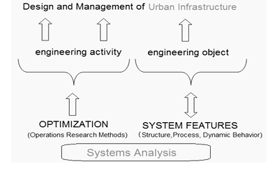
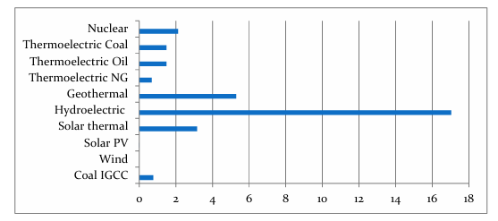
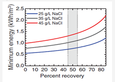
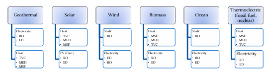
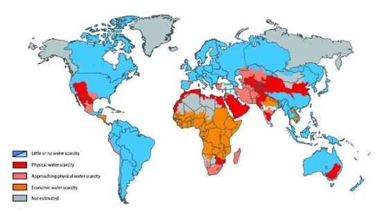
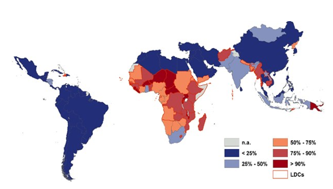
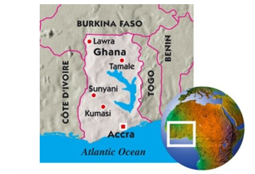

<!--
Markdown transcription of the original 2013 thesis PDF.

Text and organization are preserved as closely as practical from PDF extraction.
For equations, complex tables, page layout, and embedded third-party figures,
consult the original PDF.
-->

# Chapter 1 — Introduction

## 1.1 Introduction

Meeting water infrastructure demands in a large city in the developing world is a significant challenge. In Ghana, the Greater Accra Metropolitan Area (GAMA) is faced with a number of imminent decisions related to water and energy supply. The planning framework, to date, has been largely fragmented. In addition to current water supply shortages, the electricity sector is in need of substantial investment both in terms of repairs of existing systems and new generation capacity (Volta River Authority, 2010). The interconnections between water and energy — or the “water-energy nexus” — need to be understood in order to make intelligent investment decisions. The large volumes of water needed to generate electricity, as well as the large energy requirement to pump, treat, and distribute water, demand that these infrastructure projects be planned in a fully integrated manner.

To help meet water-supply demand, Ghana Water Company Limited is planning new supply and treatment facilities near Accra, Ghana (Ghana, Ministry of Water Resources, Works and Housing, 2010). This includes a 60,000 m³/day desalination facility which will be the first large-scale build-own-operate (BOO) desalination contract ever to be signed in West Africa (Befesa Desalination Development Ghana, 2011), raising a number of unique technical and institutional questions:

- Is desalination needed in a country such as Ghana, which has access to freshwater resources?[^1]
- Which desalination method best suits local circumstances and best available technology (BAT)?
- Is there sufficient energy for the water-supply facility; in the case that current energy supply is not sufficient, which type of power facility would be most appropriate?
- Lastly, there are administrative and economic questions surrounding the cost and affordability of such a project and whether it is the best alternative to meet human needs for water.

<!-- PDF page 17 -->

In other words, this proposed desalination project raises a number of broader questions in terms of both desalination technology and infrastructure planning in the region.

## 1.2 Problem Statement

Data in Chapter 2 indicates that the Greater Accra region faces significant demand for water and energy infrastructure, and planning needs to be undertaken in an integrated manner. The construction of a seawater desalination facility has been contracted, and more desalination capacity is one alternative for long-term water supply in the metropolitan area. However, there are many factors to take into account when considering infrastructure investment, such as cost, environment, technology, social impact, feasibility, and so on.

**Problem statement:**

> With multiple criteria and decision-making factors, an optimal solution for water-supply infrastructure in the Greater Accra Region needs to be identified and analyzed from a technical and economic standpoint.

*Figure 1. The problem statement is based on systems analysis for integrated planning and management of urban infrastructure: optimization of the activity (based on operations research) will be followed by analysis of the engineering objects (structure, process, etc.) (Arnold, 2010).*

## 1.3 Significance of Study

Basic infrastructure is a precursor to human health, well-being, and economic growth. Given the high demand for public-works infrastructure in the developing world in the face of constraints in terms of resources, space, and time, it is crucial that decisions be made in a systematic, integrated, and transparent manner. Applying appropriate technology in a local/regional context and implementing the right institutional reforms (such as water-management structures) may determine

<!-- PDF page 18 -->

the success or failure of not only large capital projects, but whole regions and states.

Beyond contributing to the debate regarding the specific infrastructure project in question, this study has broader implications for other such multi-criteria infrastructure projects. For example, this study addresses:

- How large infrastructure projects can be analyzed and compared in a systematic, transparent manner.
- How different technologies (in this case energy and water) compare in different circumstances for meeting the needs of various stakeholders.
- How coastal cities in the developing world can address issues of growing water supply.
- How to understand which questions can be solved with technology and which require a social policy/administrative approach.

## 1.4 Literature Review & Methodology

A broad literature review was conducted to understand the state of the art in desalination, general circumstances in which desalination is justified, and optimal power-generation/desalination configurations. These latter questions were found to depend highly on site-specific factors, so focus was placed on a specific proposed project site in Ghana in order to conduct a more detailed analysis. The Environmental Impact Assessment (Befesa Desalination Development Ghana, 2011) for the proposed desalination facility in Accra was reviewed and judged deficient in that it did not provide an adequate explanation of the alternatives to the project and did not address the large power requirement for the facility. Moreover, other water-supply investments are not sufficient to meet projected demand (Ministry of Water Resources, 2007) and were discussed independently of electricity-generating capacity.

To address this question, a literature review related to the water-supply situation in the Accra area was conducted. A recent EU-commissioned study (SWITCH EU, 2011) calls for an integrated water-management approach in the region and refers to abundant fresh-water supplies, but does not provide any specific recommendations for new infrastructure. Water resources in the region were assessed based on available hydrogeological data from published secondary sources, including the GLOWA Volta Project (Center for Development Research, RFW Universitaet Bonn, 2010). The literature mentions that regional water-supply issues are caused by a number of factors including pollution, lack of institutional framework, and frequent power disruptions (Hammond & Kemausuor, 2007; Ainuson, 2010; Fuest & Haffner, 2010; Ghana, Ministry of Water Resources, Works and Housing, 2010; TAHAL Group, 2008).

<!-- PDF page 19 -->

Most publications did not adequately address the relation between power and water-supply problems in the region. Also, to cover the forecasted demand, the literature and policy documents provide little in the way of specific investment proposals and recommendations (GridCo, 2009; Ministry of Water Resources, 2007).

In order to arrive at an optimal solution for meeting water and energy demand in the face of many variables, a multi-criteria decision-making tool (Rujula & Dia, 2010) was used based on the concept of integrated infrastructure analysis (Arnold, 2010). Evaluation was based on both specific quantitative (secondary) data and qualitative considerations to arrive at an optimum. Once optimal solutions were identified, further sources were consulted such as Kehlhofer, Rukes, Hannemann, & Stirnimann (2009) and AWWA (2011) to understand the technical and administrative details. Lastly, cost estimates were made to determine the overall feasibility of the project.

Due to distance and practical constraints, data was gathered from secondary sources and no visits to the study region were possible.

## 1.5 Background Information

### 1.5.1 Integrated Infrastructure Development

According to the OECD, about $71 trillion needs to be invested in basic infrastructure worldwide until 2030. Given limited resources and capital, significant decisions will have to be made which balance a number of local and global factors such as demographics, climate change, available natural resources, economics, and technology.

As urban regions grow, the supply of fresh water and disposal of rainwater and wastewater become a complex organizational task and technical art (Arnold, 2010). By 2025 it is projected that two-thirds of mankind will live in water-stressed areas due to physical/economic water scarcity (FAO, 2013). This is perhaps most apparent in Middle East/North Africa and Southeast Asia regions which face a combination of limited fresh-water resources and rapid population growth. This presents a considerable challenge for planners who are faced with scarce resources to meet rapidly growing water-infrastructure demands.

### 1.5.2 The Water-Energy Nexus

In addressing aspects of the water-management infrastructure, the connection between electricity generation and water must be taken into consideration. Power

<!-- PDF page 20 -->

generating facilities consume significant amounts of water and water supply requires large amounts of electricity. Rising demand for renewable and alternate forms of energy can significantly increase water consumption, as producers and consumers seek to reduce carbon emissions and many renewable energy sources are potentially water-intensive (World Policy Institute, 2011). For example, soy- and corn-based biofuels can consume thousands of times more water (from irrigation) than conventional energy sources (ibid.).

Primary energy exploration and extraction is often water-intensive. Oil-sands extraction, as found in Canada, can consume 20 times more water than conventional drilling. The debate around hydraulic fracturing for natural gas has also focused on potential pollution of groundwater and aquifers (World Policy Institute, 2011).

Energy generation extracts and consumes large amounts of process water. One debate around nuclear energy, for example, is the impact large water withdrawals for thermal generation can have on marine organisms. Traditional gas, coal, and nuclear plants account for 20% of the non-agricultural water consumption for cooling. Even renewable technologies like concentrated solar power (CSP) have raised questions regarding water consumption in arid regions. Hydroelectric plants can significantly alter water courses and marine life with further implications for water supply.

*Figure 2. Average water consumed (m³) to produce 1 MW of electricity (World Policy Institute, 2011).*

The other side of the nexus is the energy consumption of water infrastructure itself: 6–18% of a city’s energy demand is used to produce, treat, and transport water (Richards, 2008). Technology to treat waste water and saline water, such as membrane processes, requires significant amounts of energy for the applied pressure. For example, for seawater desalination 28–50% of the total facility cost is usually due to the electrical power requirements (Water Reuse Association, 2011).

<!-- PDF page 21 -->

### 1.5.3 Desalination

Desalination refers to processes to remove salt (sodium chloride) and other minerals from seawater, brackish water, or other sources. It is a process dating to antiquity, with the first patent dating back to 1869. Finding cost-effective, environmentally sound methods of desalination remains one of the most pertinent challenges of water-supply engineering.

As population continues to grow in water-stressed coastal regions, seawater desalination is increasingly required in order to meet fresh-water requirements. Fresh water, defined as water with less than 500 parts per million (ppm) of dissolved salts, makes up less than 3% of all water on earth. Less than 10% of this (0.3% of total) is considered renewable (Wikipedia, 2013). Demographic trends such as growing populations in coastal, water-scarce regions and an average water-consumption rate of 200–400 litres/cap/day will put greater stress on freshwater resources in the coming decades. Desalination is seen as one solution to the growing demand for this most basic of human needs.

The current worldwide desalination market is over $10 billion and provides a volume of over 68,000,000 m³/day. Capacity is projected to rise 9.6% annually and double by 2020 (Global Water Intelligence and Water Desalination Report, 2012). With over 14,000 installed plants to date, and plants as large as 880,000 m³/day, the technology is well established (ibid.). The largest regional use is currently in the Middle East with Saudi Arabia and the UAE accounting for about 30% of total installed capacity, followed by the U.S.A. at 13%.

Desalination can be divided into two main methods: phase-change thermal evaporation and membrane separation. Thermal processes use heat to evaporate water from a salt solution, and condense it in order to get pure water. Membrane processes use mechanical pressure, electrical potential, or a pressure gradient across a membrane in order to separate salt ions from the solution (AWWA, 2011). An overview of the various methods is found in the table below.

Membrane technology is the method used for nearly 60% of the installed desalination capacity with most of the remaining capacity covered by the thermal processes multi-stage flash (MSF) and multi-effect distillation (MED). Seawater accounts for over 60% of all water sources for these plants and almost 70% is for municipal

<!-- PDF page 22 -->

uses (IDA, 2008). Demand is expected to be led by the Middle East/North African region, followed by Asia Pacific and the U.S.

**Table 1. Primary technologies for desalination** (adapted from AWWA, 2011)

| Desalination method | Description |
|---|---|
| **Reverse Osmosis (RO)** | Pressure-driven process that currently is the most widely used method. Based on overcoming the natural osmotic pressure gradient, which is reversed by application of a hydraulic force across a semi-permeable membrane. |
| **Forward Osmosis (FO)** | Similar to RO: water transports across a membrane that is impermeable to salt. FO, however, utilizes an osmotic pressure gradient induced by a draw solution. |
| **Electrodialysis (ED)** | Electrochemical process for the separation of ions across charged membranes with the electro-potential difference as the driving force. |
| **Multi-Stage Flash (MSF)** | Water heated through a series of stages, each with successively lower temperatures and pressures. Flashing, or rapid boiling, is caused by the reduced pressure. The flashed water is condensed and collected. |
| **Multi-Effect Distillation (MED)** | Consists of multiple stages (effects); in each stage the water is heated by steam in tubes. Some water evaporates and, as steam, flows into the tubes of the next stage. Steam is condensed and collected. |
| **Vapour Compression (VC)** | Evaporation of water through heat from the compressed vapour which was obtained from distillation. |

A typical desalination system consists of five process steps:

1. **Intake** — structure to extract source water and transport it to the process system.
2. **Pretreatment** — removal of suspended solids and control of biological growth, to prepare source water for further processing.
3. **Desalination** — process that removes dissolved solids, primarily salts and other inorganic constituents from the source water.
4. **Post-treatment** — the addition of chemicals to the product water to prevent corrosion of downstream piping.
5. **Concentrate management** — the handling and disposal or reuse of waste residuals from the desalination system.

<!-- PDF page 23 -->

Despite the appeal of desalination to meet growing demand in water-stressed coastal urban regions, barriers remain. These include high energy costs and ecological impacts of concentrate disposal.

Despite significant efficiency improvements in recent years, desalination remains an energy-intensive process requiring 3–7 kWh/m³ of water produced (see Table 2 below) (Elimelech & Philip, 2011). State-of-the-art thermal and electrical energy requirements for desalination vary depending on the technology. Forward osmosis is a promising technology which, under laboratory conditions, has begun to approach the theoretical minimum work. But this technology is in development and little information is available at the commercial scale. Among established technologies, RO and MED have the lowest specific energy requirement. However, MSF can process larger volumes (than MED) and is most often coupled to power stations in the Middle East region.

<!-- PDF page 24 -->

> **Box 1. Theoretical Minimum Work for Desalination**  
> All desalination systems have a theoretical minimum work needed to separate salt ions, which exists regardless of the technology used (Committee on Advancing Desalination Technology, 2008). The mathematical expressions in the PDF extraction did not survive cleanly in text form; consult the original PDF for the exact equations. The theoretical minimum energy for desalination at zero recovery (removal of a small amount of freshwater from a large amount of seawater) is given as **0.70 kWh/m³ at 25 °C**.

*Figure 3. Minimum work for seawater desalination per m³ of water produced. Recovery rates in most current RO plants are 44–55% (Elimelech & Philip, 2011).*

**Table 2. Primary desalination technologies and required energy input** (see Table 1 for abbreviations; McGinnis & Elimelech, 2007)

| Technology | GOR | Electrical energy (kWh/kgal) | Electrical energy (kWh/m³) | Steam pressure (psia) | Equivalent work (kWh/m³) |
|---|---:|---:|---:|---:|---:|
| MSF | 12 | 10.04 | 2.65 | 25.7 | 5.66 |
| MED-TVC | 14.73 | 6.04 | 1.60 | 25.7 | 4.05 |
| MED-LT | 12 | 6.04 | 1.60 | 6 | 3.21 |
| RO | n/a | 11.43 | 3.02 | n/a | 3.02 |
| FO | 4.4 | 0.92 | 0.24 | 1.07 | 0.84 |

<!-- PDF page 25 -->

The total cost of the desalination process depends largely on the efficient use of energy and application of desalination technology; therefore, it presupposes sustainable supplies of energy. Currently, the majority of desalination plants are powered by fossil fuels. In certain regions of the world, energy-security concerns (such as finite fossil-fuel supplies) are relevant to the application of desalination technology.

### 1.5.4 Coupling Energy Supply and Desalination

To maximize efficiency of energy in desalination, there is interest in using renewable energy sources (such as wind, solar, geothermal) or cogeneration (with thermal generation cycles using fossil fuels or nuclear) for desalination processes. As indicated in Figure 4 below, renewable energy can be used as either a heat source for thermal desalination processes or electrical power for membrane processes. Since desalination plants consume significant amounts of energy compared to other point uses — higher even than most industrial plants — the co-location of power generation and desalination facilities can avoid transmission losses or utilize waste heat from generating plants.

Renewable-energy-powered desalination is a particularly attractive prospect for regions in the developing world that may not be connected to an electrical grid. Also, many regions in the developing world face both water and energy infrastructure deficits. Therefore, the coupling of various energy sources with desalination has been widely studied. Proper coupling of the appropriate power-supply and desalination systems is seen as crucial if the system is going to provide consistent water supply at reasonable cost (Schorr, 2011). With rising fuel prices, renewable-powered desalination processes are becoming competitive with fossil fuels in some locations (NATO Security Through Science, 2007).

*Figure 4. Options for energy provision for desalination (see Table 1 for abbreviations) (Schorr, 2011).*

As with stand-alone renewable-energy generation, the selection of technology depends on site-specific factors such as solar insolation, wind velocity, geothermal potential, and so on. Issues such as intermittency and energy storage are relevant as

<!-- PDF page 26 -->

desalination requires a reliable, consistent supply of energy. Technology for renewable desalination has been established both at the pilot and commercial scale. Some examples are outlined in Table 3 below.

**Table 3. Existing examples of desalination coupled with renewable energy systems** (adapted from NATO Security Through Science, 2007)

| Power source | Location(s) | Details | Comments |
|---|---|---|---|
| Solar salt pond | Islands of Cape Verde; El Paso, Texas | MSF pilot plant; 300 m³/day. MSF pilot; 19 m³/day. | Low volume of water produced. |
| Solar photovoltaic (PV) | Over 40 projects since the 1980s across North Africa, Middle East, southern Europe, and the U.S. West Coast | Mainly reverse-osmosis plants with PV cells and battery storage | High cost for PV cells; does not currently compete with fossil fuels on a cost basis. |
| Solar thermal | Jordan; South Australia | Coupled to membrane or distillation processes | Small scale, often for rural/remote communities; unproven at larger scale. |
| Wind | Kwinana, Australia | Reverse osmosis producing 140,000 m³/day; powered by 80 MW wind farm | Intermittency; requires storage and grid connection. |
| Geothermal | Algeria pilot | Brackish water pumped and absorbed heat from geothermal fluid; desalination through cascading evaporation and condensed | Used for greenhouse crop production; replaces conventional irrigation. |
| Cogeneration | Various | Widely used method to use waste heat from generating plants for thermal desalination | Main source is fossil fuel and nuclear; not considered renewable. |

<!-- PDF page 27 -->

Of the different possible combinations, the most attention has been given to MED coupled with solar thermal collectors and RO with photovoltaics. Among renewable sources, wind power is currently most common for large-scale RO facilities. However, selection and use of renewable energy is highly dependent on site-specific conditions and there is no one technology that is best in all cases.

### 1.5.5 Regional Context: West Africa

Until recently, desalination was considered most appropriate for relatively energy-rich, developed regions due to its high cost/energy demand. However, the combination of improved desalination processes and increased urgency for water resources has made desalination more globally applicable, including for developing countries (Schiffler, 2004).

Relatively abundant fossil-fuel supplies and solar potential in the North African regions are combined with physical water scarcity. In the Central and West regions, more generous physical water supplies are met with more modest fossil-fuel resources. Moreover, even if water supply is available, the combination of poor infrastructure, low incomes, and poor system management makes improved water supply unaffordable or inaccessible (Ainuson, 2010). This combination leaves much of the continent with either physical or economic water scarcity, creating a need for both expansion of supply infrastructure and policy reform.

*Figure 5. Physical or economic water scarcity covers most of the African continent (image source: IWMI, 2006).*

<!-- PDF page 28 -->

*Figure 6. Share of people without electricity access in developing countries in 2008 (UNEP).*

It is predicted that half of the African population will face considerable water scarcity by 2025 and desalination is seen as a partial solution (Ababa, 2000). The West African region, which is facing urban growth, economic water shortages, and expanding energy infrastructure — including pipelines and generation facilities associated with West African oil and gas reserves — presents a number of challenges in terms of infrastructure development. Ghana has a more diverse energy-resource mix and wider range of freshwater resources. Also, the Accra area is important as a large industrial centre creating the need for larger-scale urban infrastructure (as opposed to smaller-scale solutions perhaps appropriate to rural areas). The trade-offs between different water and energy supplies and technologies, and the need for integrated infrastructure planning, are pronounced in this region.

*Figure 7. Map of the study area (source: New Internationalist).*

<!-- PDF page 29 -->

[^1]: Environmental Impact Assessment (EIA) law requires project justification and assessment of the possible alternatives to the initiative. In the case of a seawater desalination facility, this includes exploring alternatives such as using available freshwater supplies or recycling wastewater.
