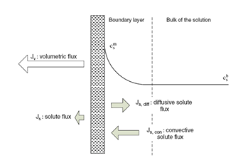
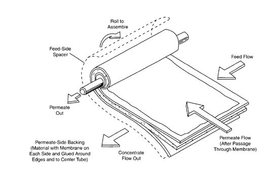
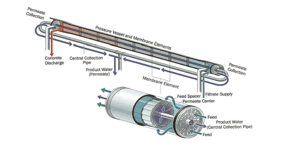
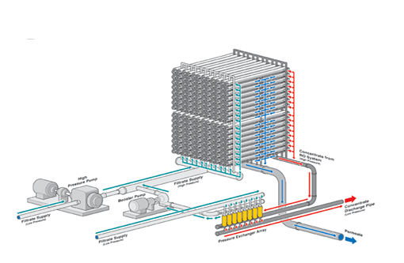
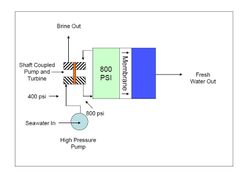

<!--
Markdown transcription of the original 2013 thesis PDF.

Text and organization are preserved as closely as practical from PDF extraction.
Figures are linked from `../figures/NN-figure.png`.
Tables have been reconstructed as Markdown tables where the extraction was recoverable.
Equations have been restored in LaTeX where the surrounding text made the expression clear.
Where exact notation could not be recovered with confidence, this is explicitly noted and
the original PDF should be treated as authoritative.
-->

# Chapter 3 — System Features

The aim of this chapter is to describe basic system features for the design of the water supply, desalination, and energy systems identified in the previous chapter. The purpose is to determine the technical feasibility, size, and environmental impact of the proposed infrastructure, and provide a basis for understanding financial/legal aspects analyzed in later sections.

The comprehensive system model should answer the following questions $$
J_s = \frac{kD}{\delta}(C_f-C_p)
$$

*Equation 3.3.2.1.iii — reconstructed from the variables defined immediately below.*

\(J_s\) is the solute flux, k the partition coefficient, D the diffusion coefficient, the
f       s
membrane thickness, C and C the salt concentration of the feed an permeate respectively (Capolla, 2009). Flux is determined by the designer of the RO system and is not an inherent property of the membrane and depends on the influent water quality, specifically the silt density index (SDI). The recommended flux for seawater given by Dow Water and Pr°Cess Solutions is 37-42LMH (litres/meter/hour) (Kucera, 2010).

<!-- PDF page 96 -->

#### 3.3.2.2 Concentration Polarization

During RO operation, concentration polarization °Ccurs at the surface of the membrane where dissolved ions accumulate in a thin layer of feed water. Concentration polarization is the ratio of the salt concentration at the membrane surface and the salt concentration in the bulk solution causing reduced overall flux, scaling, and increase in solute flux. This reduces the separation properties of the membrane. Concentration polarization can be reduced by good mixing of the feed solution with the solution near the membrane wall. At high feed rates and low permeation rates this will be minimized.

Prediction of solute concentration polarization on the membrane surface in crossflow is important in designing RO pr°Cesses and estimating their performances. This can be measured by a “concentration polarization factor” or the ratio of a substance at the surface of the membrane to that in the bulk solution. For modelling, it is assumed in steady state that the convective transport of solutes to the membrane surface is counterbalanced by a diffusive flux of retained solutes back into the bulk solution (Capolla, 2009).

> **Equation 3.3.2.2:** The mathematical expression did not survive PDF-to-text extraction clearly enough to reconstruct with confidence. See the original PDF for the exact concentration-polarization equation.

Where s refers to the solute, m and b refer to concentrations at the membrane surface and in the bulk solution, respectively, Jw is the transmembrane volumetric
flux, c the concentration, R the rejection coefficient             , (where p refers
to permeate) and κ the mass transfer coefficient, calculated using Sherwood (Sh), Reynolds (Re) and Schmidt (Sc) numbers:

Where α, β and γ are numerical coefficients. Generally a value of 1.0 – 1.2 is acceptable.

<!-- PDF page 97 -->

*Figure 42. Membrane flux (AWWA, 2011).*

#### 3.3.2.3 Compaction

Compaction °Ccurs when a polymeric membrane is put under pressure and the structure of the polymers is slightly reorganized leading to a lowered flux and notable permeability loss. Therefore, correct application of pressure is important.

#### 3.3.2.4 Membrane Structure

The membrane itself is arranged into a configuration, the most common being spiral wound. The spiral membrane consists on number of membrane envelopes, connected to central perforated tube and wrapped. The membrane envelopes are separated by feed spacer. The feed spacer forms feed-channels and promotes turbulence and mixing of the feed-concentrate stream. The feed channel is about
0.7 mm thick. The commercial membrane elements are about 20 cm in diameter,

100 cm long. Each element contains about 40 m² of active membrane area. In field applications seawater element produces about 12-30 m³/day of permeate. Membrane elements are connected in series inside a pressure vessel. Pressure vessel can operate with 6 to 8 elements connected in series, with concentrate from one element acting as the input for the next in the series. Pressure vessels are arranged in a train parallel array of a single or two-stage configuration. In some applications, if single pass can not produce required quality, a second pass is applied. In large systems, the number of pressure vessels per train is 100-200.

<!-- PDF page 98 -->

*Figure 43. Spiral-wound membrane (AWWA).*

*Figure 44. Membrane pressure vessel with eight elements (AWWA).*

<!-- PDF page 99 -->

*Figure 45. Pressure vessels arranged in trains of 100–200 (International Waterworks Association, 2010).*

The most common polymers used for RO membranes are cellulose acetate and aromatic polyamide (or thin film composite) membranes. One drawback of cellulose acetate membranes is the possibility of deterioration by hydrolysis. Composite membranes provide greater salt rejection and higher water production per unit membrane area. Composite membranes are stable over a broad pH range and can withstand temperatures as high as 45°C. However, membrane materials generally deteriorate upon exposure to chlorine. A full discussion of membrane properties is beyond the scope of this work and the properties of one commercially available membrane are presented below:

Polymer              Structure               Properties
(Aromatic)                                   Hydrophilic, good solvent
Polyamide (PA)                               resistance.

An example of RO membrane is a Dow Filmtech:

Membrane         Active          Permeate        Boron           Salt rejection
Model            surface area    flow rate       rejection
SW 30XHR-        41m²            25m³/day        93%             99.82%
440i

<!-- PDF page 100 -->

### 3.3.4 Pressurization and Power Requirement

Pressure is provided by one or more pumps placed prior to the membrane trains. This constitutes the largest energy consumption requirement in the RO pr°Cess. The pump system is usually equipped with a variable frequency driver to adjust the pressure according to temperature and salinity of the feed. Pressurized water enters the membrane arrays and permeate leaves at still elevated pressure which can be recovered with an energy recovery turbine. The required feed pressure is function of feed salinity, temperature, recovery rate and permeate flux rate. Based on the flow rate and pressure, pump curves can be used to determine impeller diameter, required power, and efficiency.

The power consumption of the RO pr°Cess is the sum of the components:

(Equation 3.3.4.i)

The high pressure pumping usually accounts for over 80% of the total power requirement. Energy recovery can be modelled in kWh/m³.

> **Equation 3.3.4.ii:** The source extraction did not preserve the full expression reliably. The variables identified in the thesis are concentrate pressure \(P_c\), recovery rate \(R\), and efficiency \(\eta\). Consult the original PDF for the exact formula.

Where Pc is the concentrate pressure, R the recovery rate, and η the efficiency.

The pressure requirement for reverse osmosis is cited as 800-1,180 psi or 6-8 MPa. The electrical energy requirement can be calculated from flow, pressure rise, and pump efficiency.

> **Equation 3.3.4.iii:** The source extraction did not preserve the numerical unit-conversion constant, so the exact original form is retained only in the PDF. In SI form, hydraulic power is proportional to \(Q\Delta P/\eta\).

Where P is the pump shaft power (in horsepower), Q is the flow rate, ΔP is the differential pressure and η is the pump efficiency.

<!-- PDF page 101 -->

*Figure 46. Turbine energy-recovery device with input pressure at 50% of the high-pressure pump (image source: buildingenergy.cx).*

### 3.3.5 Post Treatment

Post-treatment is needed to address deficiencies in mineral content and low pH and includes one or more of the following (AWWA, 2011):

- Stabilization by addition of carbonate alkalinity
- Corrosion inhibition
- Remineralization by blending with high mineral content water
- Disinfection
- Water quality polishing for enhanced removal of specific compounds (eg.
boron, silica, dimethylnitrosamine.

The overall goal is to meet WHO guidelines and having an acceptable taste for the consumer. In addition to the points outlined above, sources of other anthropogenic pollutants will have to be considered as well. In this case of a biomass plant, detailed analysis would have to be carried out regarding the impacts of l°Cating organic material close to the water source. However, given the deep water intake and pretreatment disinfection, this is not expected to be an issue.

#### 3.3.5.1 Carbonate Alkalinity and Corrosion

The addition of carbonate alkalinity stabilizes pH protecting against corrosion which can affect pumping costs, public acceptance of treated water and exposure to heavy metals. 4-10 mg/L calcium carbonate with alkalinity >40 mg/L and total hardness >50 mg/L is therefore maintained.

<!-- PDF page 102 -->

#### 3.3.5.2 Remineralization

Minerals such as calcium and magnesium are low content in permeate and is therefore blended with sourcewater. With 1% blending, 4-5mg/L calcium, 12- 17mg/L magnesium plus sodium chloride and other ions are added to meet WHO drinking water standards.

#### 3.3.5.3 Disinfection

Chlorine or UV is used to disinfect the product water. Chlorine depends on contact time and temperature, but usually the dosage is 1.5-2.5 mg/L as sodium hyp°Chlorite. Disinfection is relatively easy because of the relatively low TOC and particle content, low microbial loads, and minimal oxidant demand after desalination treatments. Issues to be considered include (AWWA, 2011):

- Passage of viruses through some RO membranes.
- Potential loss of integrity of membranes which could lead to the passage
of various pathogens through the pr°Cess water.
- The practice of blending source water with desalinated water which raises
the need to define appropriate targets for treatment and disinfection of water used for blending.

#### 3.3.5.4 Water Quality Polishing

Enhanced treatment may be required for specific compounds such as boron and silica. Treatment technologies will depend on the compound chosen and may include ion exchange, granular activated carbon filtration or additional membrane treatment.

#### 3.3.5.5 Storage

Treated water is stored in tanks of water towers where it can be fed into the system according to demand. Risk management and reduction strategies are used to limit the health risk ass°Ciated with the distribution of piped water, including desalinated water.

### 3.3.6 Brine Management

Brine (or concentrate) is generated as a by-product of the separation of the minerals from the source water. The amount is usually twice that of the desalination water. In addition to the minerals separated from the source water, the chemicals used in pre-treatment may be found in the brine solution. The TDS (total dissolved solids) content of concentrate is usually 65,000-85,000 mg/L while the amount of particles, total suspended solids and bi°Chemical oxidation demand is usually below 5mg/L (AWWA, 2011). The concentrate may have a negative impact on the environment, particularly when disposed of directly into

<!-- PDF page 103 -->

the aquatic environment as the salinity can have toxicological impacts on organisms. The salinity tolerance threshold depends highly on the specific site.

Disposal methods include surface water discharge, sanitary sewage discharge, deep well injection and evaporation ponds. The environmental impacts of surface water discharge are still widely unknown and depend on l°Cal circumstances such as the aquatic ecosystem and water flows. Injection is usually considered for inland plants where surface water discharge is not an option. The main concern with evaporation ponds include the possibility of leaking and a large land use requirement. Sewage discharge requires additional sewage capacity which may or may not be available. An overview of discharge options are outlines in Table 23 below.

<!-- PDF page 104 -->

**Table 23. Options for brine discharge** (International Waterworks Association, 2010)

| Disposal method | Description | Environmental concerns | Use (%) |
|---|---|---|---:|
| Discharge into surface water | Common practice for coastal desalination plants; reject brine is disposed into a nearby sea or ocean. Often considered the most practical and least expensive option. | Effects of high salinity and temperature on marine life remain incompletely understood; continuous disposal may affect feedwater over the long term. | 45 |
| Deep-well injection | Considered for inland plants where surface-water discharge is not viable or is very costly. | Need for a suitable well site; seismic activity could damage the well and cause groundwater contamination. | 16 |
| Evaporation ponds | Often considered effective and economical for inland plants in dry, arid regions with high evaporation rates. | Leakage may contaminate groundwater; large land-use requirement. | <1 |
| Sanitary-sewer discharge | Brine is discharged to a local sewage system and treated through conventional processes. | Local infrastructure must have sufficient excess capacity for large concentrate volumes. | 27 |

<!-- PDF page 105 -->

To take advantage of the combined outtake with the power plant, open water discharge is considered the best option from a cost perspective. The salinity tolerance threshold depends on the types of organisms living in proximity to the plant. For some organisms a large increase in the salinity of their surroundings can cause water to leave the cells, leading to dehydration and death. In addition to changes in salinity, the plume from concentrate discharge may lead to increased stratification and reduced mixing, possibly leading to reduced dissolved oxygen levels in the surrounding area, which may have ecological implications.

The EIA for a small desalination plant in Tema/Accra states (Befesa Desalination Development Ghana, 2011):

“Due to the current and wave dynamics with the proposed project l°Cation, the brine is expected to disperse as quickly as possible without causing any osmotic effects to marine organisms. It is also believed the steady state or kinetic principle (or Marcet’s principle of constant proportions) will ensure that the salinity (of the brine) within the immediate vicinity of the outlet pipes for brine disposal would be normalized to eliminate the possibility of hypersalinity. Based on the above information, no adverse impacts are envisaged on aquatic life within and beyond the immediate environment of the brine outfall pipe.”

#### 3.3.6.1 Open Water Discharge

The goal of an open water brine discharge is to dispose of the concentrate in an environmentally safe manner by accelerating the mixture of seawater and concentrate thus minimizing the high concentrate zone as much as possible. This is achieved using the naturally °Ccurring mixing capacity of the surf zone or by discharging the concentrate beyond the tidal zone. Also, the installation of diffusers at the end of the discharge pipe will improve mixing. The length, size, and configuration of the outfall and diffuser structures for a large desalination plant are typically determined based on hydrodynamic or physical modeling for the site specific conditions of the discharge l°Cation [4]. The area must be free of endangered species or stressed habitats, with strong °Cean currents to facilitate mixing. In none of the literature surveyed was this raised as an issue at the l°Cation in question.

### 3.3.7 System Design and Modeling

RO system design incorporates aspects discussed in the previous sections. The data is used below to arrive at precise size and scale parameters for the plant which, in turn, are used for a cost analysis in later sections.

<!-- PDF page 106 -->

Water flux is the initial design parameter based on water source quality. An appropriate membrane is then selected. Based on these parameters, the required array and number of modules are given by (Kucera, 2010):

$$
N = \frac{F}{J_w M_A}
$$

*Equation 3.3.7.1.*

where \(J_w\) is water flux, \(F\) is product flow rate, \(N\) is the number of modules, and \(M_A\) is membrane area per module.

Jw = water flux, gfd

F = product flow rate, gallons/day

N = number of modules

MA = membrane area per module

Other parameters including operating pressure, scaling indices, product and concentrate water quality are then determined. Feed flow rate, pressure, and permeate flux are entered as inputs and plant parameters derived in sequential fashion. Full calculations can be found in the appendix with results presented in Table 24 below.

<!-- PDF page 107 -->

**Table 24. RO system design parameters based on the above equations and assumptions**

**Feed water**

| Parameter | Value |
|---|---:|
| Qf | 1,000,000 m³/day |
| Cf | 19.65 kg/m³ |
| Pf | 14.36 bar |
| Tf | 33.39 °C |

**Operating conditions**

| Parameter | Value |
|---|---:|
| ΔP | 97.52 atm |
| Δπ | 47.63 atm |
| Jw | 0.01086 kg/s·m² |
| Js | 0.01177 kg/s·m² |
| Cp | 0.03537 kg/m³ |
| Pump efficiency | 80% |
| Turbine efficiency | 85% |
| Motor efficiency | 96% |
| Energy for water supply | 4,678.82 kW |
| Energy for transfer pump | n/a |
| Energy for high-pressure pump | 4.35 kWh/m³ |
| Energy of product pump | n/a |
| Energy recovery | 1.094 kWh/m³ |
| **Net energy consumption** | **3.25 kWh/m³** |

**Plant design parameters**

| Parameter | Value |
|---|---|
| Production capability | 480,000 m³/day |
| Raw-water supply | 1,000,000 m³/day |
| Production-unit data | 25 m³/day/unit |
| Number of membrane elements | 12,476 |
| Operating RO pressure | 5.516 MPa |
| Recovery | 48% |
| Pressure-vessel array | 1 stage |
| Elements per vessel | 8 |
| Vessels per train | 120 |
| Membrane-element size | 40 in length × 8 in diameter |
| Manufacturer | Dow |
| Model | SW30XHR-440i |
| Configuration | Horizontal, parallel series |
| Type | Polyamide |
| Salt rejection | 99.82% |
| Boron rejection | 93% |

<!-- PDF page 108 -->
