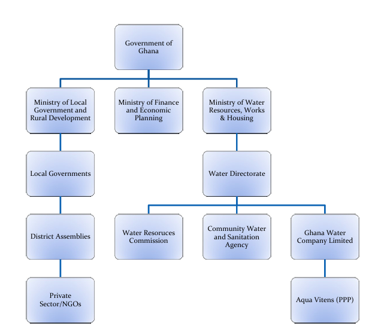
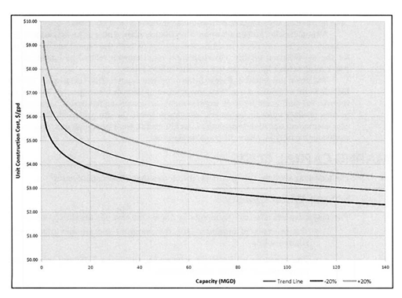
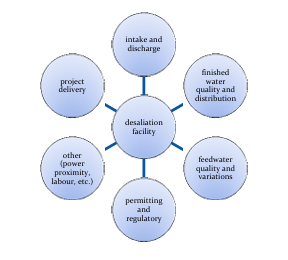
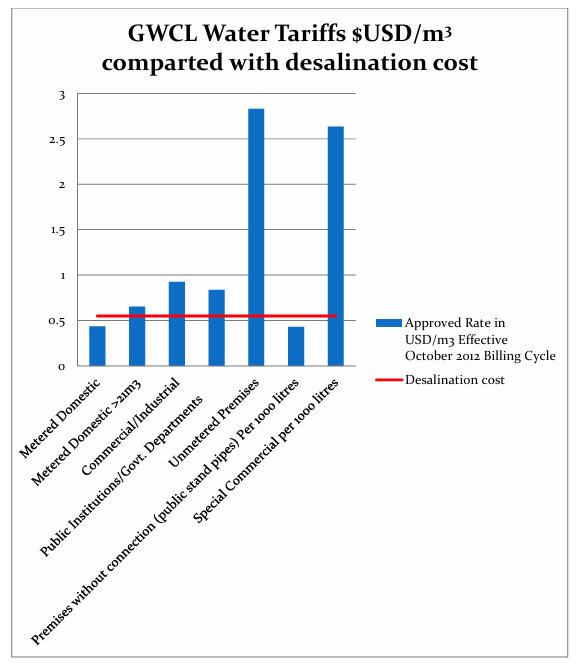

<!--
Markdown transcription of the original 2013 thesis PDF.

Text and organization are preserved as closely as practical from PDF extraction.
Figures are embedded from `../figures/NN-figure.png`.
Tables have been reconstructed as Markdown tables.
Equations 4.2.1 and 4.3.2 have been restored from the original PDF.
The original PDF remains authoritative for page layout and any remaining formatting details.
-->

# Chapter 4 — System Cost and Organization

Organization This chapter analyses the cost of water and power facilities, including financing and tariff to the consumer. The purpose is to analyze the feasibility and affordability and determine how the proposed system compares with alternatives.

## 4.1 Energy/Water Sector Management

### 4.1.1 Water Management in Greater Accra

Within the Greater Accra Metropolitan Area, several models for the delivery of water services are available: utility managed water supply, managed by Ghana Water Company Limited (GWCL); privately managed water supply; community managed water supply; and self-supply. Private managed water supply can either depend on the GWCL network (intermediary private providers) or on own sources of water (independent private providers) (SWITCH EU, 2011).

The main source of piped water for the Accra Metropolitan Area is the GWCL system which operates as a state owned limited liability company under the Ministry of Water Resources, Works and Housing. Its stated objectives are to supply, distribute and conserve water for domestic, industrial and public purposes. The setting of standards/water quality monitoring falls under the separate Public Utility Regulatory Committee. One becomes a customer of GWCL only if they are connected to the system and there are many consumers in the city who are not considered customers of GWCL. In order to increase efficiency private public partnerships PPPs where developed. With public controversy, GWCL contracted management of the system to Aqua Vitens Rand Limited (AVRL) as part of urban water sector reforms in 2006 and with support of donor agencies infrastructure was upgraded. Under the contract GWCL is responsible for planning and investments in capital projects and AVRL is responsible for operation and management of the system.

In 2008, a National Water Policy came into effect focused on water resource management, urban water supply, and community water and sanitation. Despite numerous efforts and investment, the water supply system still suffers from lack of institutional structure. Supply shortages have been cited as due to lack of compliance to reforms on behalf of service providers and poor sector coordination (Fuest & Haffner, 2010).

<!-- PDF page 109 -->

*Figure 47. Table of organization in the urban water sector in Ghana, adapted from Ghana, Ministry of Water Resources, Works and Housing (2010).*

GWCL provides water directly to customers and indirectly through other service providers, bottled water companies, sachet bags and tankers. The Weija Dam is connected to three separate treatment plants which supply the western regions of the city by gravity. The other major supply, the Kpong, delivers water via a 54km pipeline to the Tema terminal reservoir which has capacity of 172,800m³/day. From here, water is pumped via a booster station to the Accra reservoir. The Tema reservoir directly supplies the municipality of Tema. The supply mains in questions are highly corroded and are in need of repair/replacement. The cost of supplying water from the Kpong works is increased due to pumping and transport.

### 4.1.2 The Electricity Sector in Ghana

Administration of the electric power industry falls under the Ministry of Energy who is responsible for development of electrical policy in Ghana. The Volta River

<!-- PDF page 110 -->

Authority (VRA) is responsible for the power generation, transmission and system operation for the entire country. The Electricity Company of Ghana (ECG) is responsible for distribution in southern Ghana and the Northern Electricity Department (NED) is responsible for distribution in the northern part of the country. All agencies are owned by the Government of Ghana and regulated by the Energy Commission and the Public Utility Regulatory Commission (PURC). Private generators are entities that build power facilities in the countries and sell electricity to VRA and ECG. The Energy Foundation is a Ministry of Energy directed Private Enterprises Foundation (PEF) initiative established to promote energy efficiency and conservation. The supply consists of hydro and thermal stations. The VRA transmission network includes 36 substations and 4000km of transmission lines at voltages of 161KV and 69KV with interconnections to both Cote d’Ivoire and Togo (Frazier, 2010).

Following the contracting of the thermal station, the generation is operated by both VRA and the Takoradi International Company (TICO). Sector reforms have failed to attract private investment as intended due to inefficient market structure due market distortions caused by government monopoly subsidies. Tariffs for bulk consumers such as ECG are regulated by the Energy Commission and PURC. The tariff is set using a formula for Bulk Supply Tariff (BST) and Distribution Service Charge (DSC). The End User Tariff is about 9.12 US cents/kWh for residential. The End User Tariff is the sum of the Bulk Supply Tariff (BST) and Distribution Service Charge (DSC). Poor tariff collection efficiency and operational inefficiencies have been cited as barriers to proper financing of the system.

The current regulatory policy is the result of restructuring of the electricity sector as part of broader national infrastructure and public institutional reforms brought on by multinational donor agencies. The objectives of the reform included structural changes within the sector to bring about competition in supply, transparency in the regulation, and to encourage private investment. This included unbundling of the sector with multiple generators and adoption of public private partnerships (Resource Centre for Energy Economics and Regulation , 2005).

## 4.2 Thermal Plant Cost Estimates

In today’s electricity market the economics of a power plant are modelled as any other industrial investment with expected returns on investment and accompanying risks. The return on equity (ROE) depends on the market price of electricity and production cost.

<!-- PDF page 111 -->

### 4.2.1 Production Cost of Electricity

The production costs of electricity are expressed in US$/MWh or cents/kWh depending on the capital costs of the project, fuel costs and operation and maintenance costs. Capital costs for a given power plant depends on investment costs, financing structure, interest rate and return on equity and load factor of the plant. Investment costs include the contract price of the plant, interest during construction and cost of realization of the project.

Present value is used for economic comparison of different plants. All of the costs are discounted to a reference time (usually plant start-up date) to obtain the present value. The cost of electricity (US$/MWh) is calculated as:

$$
Y_{el}
=
\frac{TCR\,\Psi}{P\,T}
+
\frac{Y_F}{\eta}
+
\frac{U_{fix}}{P\,T_{eq}}
+
u_{var}
$$

*Equation 4.2.1.*

where:

- **TCR** — total capital requirement to be written off: current value of all expenses during planning, procurement, construction, and commissioning, including the price of the plant and interest during construction (US$).
- **Ψ** — annuity factor:

$$
\Psi
=
\frac{q-1}{1-q^{-n}}
\;[1/a]
$$

- **P** — rated power output (MW).
- **T_eq** — equivalent utilization time at rated power output, in hours per annum (h/a).
- **Y_F** — price of fuel (US$/MWh thermal = 3.412 × US$/MMBtu).
- **η** — average plant net efficiency.
- **U_fix** — fixed cost of operation, maintenance, and administration.
- **u_var** — variable cost of operation, maintenance, and repair (US$/MWh).
- **q = 1 + z**
- **z** — average discount rate in percent per annum (%/a).
- **n** — amortization period in years.

In actuality, power producers do not sell electricity based on average cost but on demand/supply. When fuel price is below variable costs of production (fuel, O&M, repair), production should be avoided.

The Total Capital Requirement TCR is based on recent industry standard data for Conventional NGCC at $978/kW (U.S. Energy Information Administration, 2010). While costs in Ghana may differ, this estimate is used as an estimate. A 25 year amortization rate is assumed at 6% discount rate. Gas (YF) price was taken from projected West Africa Gas pipeline rates. Other data were derived from (Kehlhofer, Rukes, Hannemann, & Stirnimann, 2009) and presented in Table 25 below.

<!-- PDF page 112 -->

**Table 25. Cost parameters for the power plant**

| Variable | Cost / value |
|---|---:|
| TCR | $1,394,735,580.00 |
| Ψ | 0.003129069 |
| P | 1,426.11 MW |
| YF | $22.76/MWh |
| η | 0.5888 |
| Ufix | $12,000,000/year |
| Uvar | $3/MWh |
| Yel | $54.37/MWh |
| Yel | $0.054/kWh |

The cost of production estimate is considerably less than the U.S. department of energy estimate of $68.6/MWh for combined cycle plants. The lower cost of production is due mainly to the relative discount of LPG from the West Africa Gas pipeline compared to spot prices on global markets.

## 4.3 Production Cost of Water

Desalination cost estimates are widely available, but there remains a lack of common methodology for cost estimation as well as difficulty in comparing alternatives. While the cost variables are the same regardless of the project, the magnitude of cost factors can vary considerably. Therefore, site specific information must be taken into account. Moreover, most existing cost estimates are based on investment, operating and maintenance costs, excluding environmental and resource costs22.

For collocated (power plant and desalination) facilities the cost savings resulting from the shared seawater intake and warmer input temperature must be taken into consideration. Cost trends show an inverse relation between plant size and unit cost of desalinated water, with a large plant in the order of 140 MGD (530,000 m³/day) having a unit cost almost 17% less than that of 50 MGD.

[^22]: Consideration of such costs is mandatory in EU member states as stipulated in the Water Framework Directive.

<!-- PDF page 113 -->

*Figure 48. Cost with respect to plant size shows a downward trend with stabilization at around 500 MGD (Water Desalination Report, AWWA).*

### 4.3.1 Cost Components

Project costs generally consist of:

1. **Capital costs** — equipment, materials, project management, and other costs related to construction of the facility.
2. **Operation and maintenance (O&M) costs** — including labour, energy, and chemicals.

*Figure 49. Costs associated with seawater desalination (Water Reuse Association, revised Jan. 2012).*

<!-- PDF page 114 -->

Cost data can be derived empirically from existing plants and, where appropriate, used to estimate costs of new builds. Cost of water is generally expressed as $/m³. Construction costs are usually 60-80% of total capital costs and depend on many factors including (AWWA, 2011):

- Source water quality

- Product water quality

- Size of the desalination project

- Intake type and distance from the plant

- Disposal of concentrate

- Availability and cost of land

- Geotechnical conditions

- Environmental/permitting requirements

- Availability (and cost of) power

Intake water quality parameters and desired water quality will impact overall cost in that more pretreatment and membrane replacement may be required. The intake typically comprises 5-20% of the total capital cost and at least 5% for the discharge. Therefore, a shared intake/outfall can significantly reduce overall expenditure. Storage and transport of product water to customers can also be a significant cost which is influenced by existing infrastructure, proximity to customers, and terrain. Site specific factors include the geotechnics of the area/whether the site it suitable for construction; zoning and regulations; and proximity to power supply. When a desalination plant is co-built with a power plant, the appropriate power supply cost is usually added under O&M (the power plant is not considered part of the capital cost) (AWWA, 2011).

Operation and Maintenance (O&M) costs include labour, energy, chemicals, and membrane replacement with energy being the foremost expense.

### 4.3.2 Desalination Cost Estimates

Desalination cost functions are available but, since costs are highly variable and can change for any given project, one accurate method is simply preparing a budget based on the projected costs for each system component. The total cost can be estimated in this way based on historical cost data for similar projects. Total capital costs are assumed to increase linearly with plant size and with economy of scale taking place (specific cost decreases with larger plants). Using data sources including AWWA (2011), an approximation model based on plant size was developed (author’s own equation):

$$
C_i = \alpha_i Q_p\left(-8.4166 \times 10^{-7}Q_p + 1\right)
$$

*Equation 4.3.2.*

<!-- PDF page 115 -->

Where \(C_i\) is the cost (USD) of a given item \(i\), \(Q_p\) is product flow, and \(\alpha_i\) is a constant that depends on the item being estimated. The model is only approximately valid for 150,000 m³/day < Qp < 500000 m³/day. Estimates are provided in Table 26 below and calculations found in the Appendix.

**Table 26. RO plant capital-cost estimate**  
*Based on data from AWWA (2011); full calculations are in the Appendix.*

| Capital-cost estimate | Cost (USD) |
|---|---:|
| Site preparation, Cprep | $3,000,000 |
| Intake, Cintake | $0 *(included in gas-plant cost)* |
| Pretreatment | $24,600,000 |
| RO system equipment | $111,000,000 |
| Post-treatment | $6,200,000 |
| Concentrate disposal | $0 *(included in gas-plant cost)* |
| Residuals management | $4,600,000 |
| Electrical system | $7,700,000 |
| Product storage & distribution | $6,000,000 |
| Buildings | $15,400,000 |
| Start-up costs | $6,200,000 |
| Project engineering services | $33,900,000 |
| Administration, contracting, management | $7,700,000 |
| Environmental permitting | $0 *(included in gas-plant cost)* |
| Legal services | $0 *(included in gas-plant cost)* |
| Project financing cost | $37,000,000 |
| Contingency | $20,000,000 |
| **Total capital costs** | **$283,000,000** |
| **Unit cost** | **$590.00/m³** |

Due to economy of scale from building a large plant and the savings for collocating with a power plant, the unit cost is 56% of the reference data provided in (AWWA, 2011).

Operation and Maintenance costs include labour and membrane replacement and a number of fixed and variable costs. With power plant colocation the power cost is taken as the production cost of power as opposed to the market cost. O&M costs are assumed to increase linearly with plant size (ie. no economy of scale).

The cost of power will be assumed at production cost of $0.54/kWh at a power requirement of 3.25kWh/m3.

<!-- PDF page 116 -->

**Table 27. RO plant operation costs**  
*Own calculations, derived in part from AWWA (2011).*

| Operation-cost estimate | Cost (USD/year) |
|---|---:|
| Operation & maintenance | $1,826,400 |
| Replacement parts & materials | $14,268,000 |
| Replacement membranes | $6,086,400 |
| Power | $30,747,600 |
| Chemicals | $14,500,800 |
| **Total** | **$28,535,160** |

The total unit cost of water is the sum of operation and maintenance costs plus the amortized capital cost (over 25 years at 5% interest).

Unit Cost = $0.55/m3

Due primarily to the savings from the shared intake and outfall, as well as the reduced cost of power (production vs. market price) this estimate is 10-20% below industry average SWRO desalination costs. In subsequent sections this cost will be discussed and compared with current tariffs.

## 4.4 Cost Analysis

### 4.4.1 Electricity Cost Analysis

The electricity tariff rates are split into three classes based on the ability to pay, as presented in Table 28.

**Table 28. Electricity tariffs** (based on GridCo, 2009)

| Income class | Tariff (USD) |
|---|---:|
| Low income | $0.092/kWh |
| Middle income | $0.13/kWh |
| High income | $0.22/kWh |

In all cases, the estimated cost of production from the cogeneration plant ($0.054/kWh) is significantly below the market price and production is therefore considered a viable option. This amount is also well below the average cost of electricity production for the Volta River Authority which is $0.10/kWh (Volta River Authority, 2010)23.

[^23]: This amount ($0.10/kWh) includes depreciation and all other expenses, including transmission. The $0.054/kWh estimate does not include these amounts.

<!-- PDF page 117 -->

#### 4.4.1.1 Electricity Affordability & Access

Among the highest income quintile, 88% of urban dwellers have access to electricity while only 44% of the lowest quintile has access (The Energy and Resources Institute (TERI), 2011). Energy expenditure as a percentage of household income is on average 9.5% though it is actually lower for the urban poor, suggesting many do not obtain electricity through the legal utility connection. Biomass is mainly used for cooking in the urban slums while other often inefficient appliances used electricity. The majority of residents in poor areas do not have building permits, which prevents connection to the electric utility.

A recent study suggested household expenditures for urban slum-dwellers engaged in enterprises as being considerably less than expenses. This suggests improved electricity through a utility and tariff could be feasible if it provided net economic benefit such as saved time and improved health. The exception was single minimum wage workers, who on average make significantly below the cost of living.

The mix of those with the ability to pay and those unable to afford a connection, suggests a community cooperative model may be ideal where communities are integrated into the grid, through both official and semi-official connections, in cooperation with the utility.

### 4.4.2 Water Cost Analysis

Those connected to the GWCL water utility include mainly high and middle income households as well as commercial, industrial, and institutional users. Lower income individuals and households, however, obtain water through unregulated retail vendors and tanker trucks (supplied by the utility) or 0.5L water bags (sachet). There are also a number of independent community managed water supply systems which also serve primarily lower income households. Streams and surface water are also used for collection.

Generally, those connected to the utility pay much less per m3 and consume more than lower income households. Also, lower income households generally have lower water quality since alternate retailers are not regulated in terms of both price and quality.

Figure 51 below compares the water supply cost for different consumers with the estimated production cost of desalinated water. In the case of household utility connection, the current tariff is below the estimated production cost of desalinated water. However, the desalination cost falls below commercial and industrial tariffs as well as current water costs of low income households.

<!-- PDF page 118 -->

*Figure 50. Water costs (SWITCH EU, 2011) compared with the estimated SWRO production cost (adapted from GWCL; units converted to USD).*

<!-- PDF page 119 -->

The current average utility tariff in the GAMA is $0.74/m3 (averaging all consumer classes) and the average production cost $0.31/m3 (Ghana, Ministry of Water Resources, Works and Housing, 2010). The costs are compared in Figure 52 below.

*Figure 51. Utility production cost and current average tariff compared with the SWRO production-cost estimate. Production costs and tariffs derived from AVRL, SWITCH EU, and Ministry publications (Ghana, Ministry of Water Resources, Works and Housing, 2010; SWITCH EU, 2011).*

The reader should note, high tariffs relative to production cost do not necessarily mean profit margins or effectiveness of service. In the case of GWCL, tariffs have been increased to compensate for poor utility performance and financial losses (explained in detail in the next chapter).

The current GWCL cost of water production is below the estimated cost of desalination. Therefore, adding additional capacity through SWRO desalination may not appear ideal from a cost recovery perspective under current conditions.

However, the production cost of desalination water is below the current tariffs (factoring in all tariff classes); it is considerably less than the current industrial tariff and well below prices paid for non-utility water. Also, the current GWCL production cost may be artificially low due to lack of system investment and aging infrastructure.

The benefits of water security and added supply capacity that come with desalination perhaps compensate for the higher production cost. This cost/benefit discussion is analysed in more detail in the next Chapter.

<!-- PDF page 120 -->