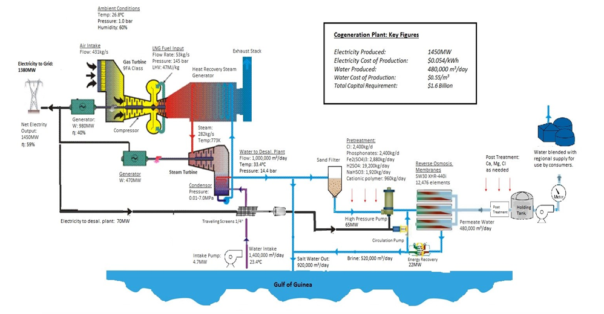
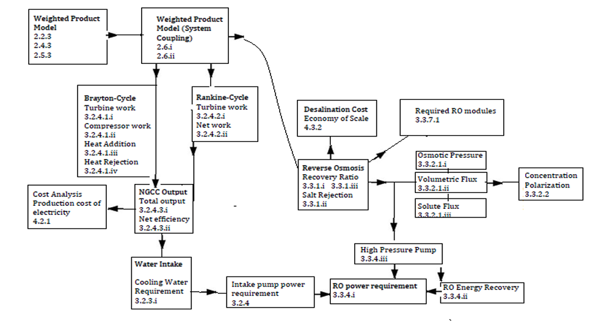

<!--
Markdown transcription of the original 2013 thesis PDF.

Text and organization are preserved as closely as practical from PDF extraction.
Figures are embedded from `../figures/NN-figure.png`.
The conclusion has been cleaned for Markdown rendering.
The original “Table of Formulas” has been reconstructed using equations restored in the preceding chapters;
where exact notation could not be recovered confidently, the original PDF is explicitly identified as authoritative.
Display equations are kept on a single line between `$$ ... $$` for more reliable GitHub rendering.
-->

# Chapter 6 — Conclusion

## 6.1 Initial Problem

The region of Accra Ghana is characteristic of many urban areas in the developing world, where urban infrastructure planning is reaching a critical stage. From the current population of less than 4 million, the Accra region is expected to grow to between 7.3 and 16.3 million by 2030 (SWITCH EU, 2011). Currently, both water and energy supply does not meet consumer demand, which can cost the national economy billions annually. In the coming years, significant decisions must be made concerning expansion of this infrastructure. With regard to water supply it is estimated 282,000 m³/day – 682,000 m³/day will need to be added to the system within 10-15 years, over and above current planned expansions. Also, plans for an additional 2,300 MW of generating capacity will need to be made in the next 3-5 years. Given the water-energy nexus, water supply and power generation need to be planned in an integrated manner.

## 6.2 The Case for Cogeneration

Current water supply alternatives were compared based on volume potential, economics, water quality, compatibility with integrated water quality management, and security of supply. There is no lack of freshwater resources, with Lake Volta providing significant supplies. Indeed, this will likely be the main supply source going forward. However, for the sake of securing future supplies, seawater desalination is a reasonable possibility compared to other immediate alternatives. The large energy requirement of desalination (and water supply in general) means additional power generation also needs to be added. Cogeneration of power and water was therefore analyzed as a potential solution to both energy and water supply challenges.

## 6.3 System Optimization

Multi-Criteria analysis was used to determine the optimal engineering system for cogeneration. Significant investments in natural gas infrastructure have been made in the West Africa region, and the raw material supply is abundant from Nigeria and even domestically. Therefore, a natural gas plant was deemed to be optimal mainly from a cost and scale perspective. Coupling a thermal plant with reverse osmosis is believed to be optimal despite the convention of using thermal desalination with thermal power generation. Given modern developments and

<!-- PDF page 148 -->

energy recovery, it is argued reverse osmosis is thermodynamically preferable in cogeneration systems and offers modularity for future expansion.

## 6.4 System Features

Based on assumptions and models, mass and energy flows as well as other key features of the cogeneration system were determined. A combined cycle power plant with 1,426 MW generating capacity was modelled with overall thermal efficiency of 58.88%. A desalination plant was modelled with 480,000 m³ production capacity, consuming about 3.25 kWh/m³ or 65MW. The cost of electricity production was estimated at $0.054/kWh and the cost of desalinated water $0.55/m³. The power cost is well below the current tariff. The water cost of production is above the current GWCL production cost, but below average tariffs. For commercial/industrial consumers desalination would help secure supply at a reasonable cost in the country’s most important economic centre.

The total capital requirement for such a cogeneration facility is estimated in the order of $1.6 billion, which is not unrealistic considering current investments taking place to expand power generation and water supply in the country. Also, the lost economic output due to under capacity would likely justify such an investment. An RO desalination plant of this size would place it among the largest in the world, but plants of this size and larger are currently in operation or being planned.

## 6.5 What Desalination Cannot Achieve

Chapter 5 presented a detailed analysis of the structural issues in the urban water sector, such as affordability and access. Desalination or other major supply expansions were determined to not be the answer to these issues. Rather, community decision making and affordable alternatives are presented as priorities for addressing the needs of the large population that cannot afford access to the utility water supply. Regulation of vendors, public standpipes, rainwater harvesting, and integrated urban planning, are solutions that are practical and affordable in the immediate term to meet Millennium Development Goals with current donor funding.

With respect to larger capital investments, upgrading the current supply network (to reduce physical losses) is likely a more intelligent investment than significant supply expansions at this time

<!-- PDF page 149 -->

## 6.6 Preliminary Conclusions

The following preliminary conclusions are made based on this study:

- Desalination of seawater on a large scale is possible in the Greater Accra region, and seawater could be an abundant, affordable supply source for most (though not all) consumers.
- The cost of desalination remains significantly higher than the main freshwater source, Lake Volta. Lake Volta will likely continue to be the main potable-water source for the growing metropolis. However, desalination would add security of supply.
- If a large desalination plant is built, cogeneration with a natural-gas plant could present cost savings and improved system performance.
- Current system upgrades, such as reducing water-system losses and electrical-transmission losses, should take priority over supply expansions, though both will be needed within the next 10 years.
- Legal and institutional reforms are needed to allow the urban poor to benefit from added water and energy infrastructure (outlined in Chapter 5).
- Desalination is not the answer to the underlying issues in the urban water sector, which are largely organizational and social rather than technical problems.

This study has some limitations in that secondary sources were used and many qualitative methods are based on assumptions. The multi-criteria method, for instance, could be described as somewhat subjective and conclusions are not intended to be “proofs” or “final decisions”.

However, the study is comprehensive in the way it presents both qualitative and quantitative analysis to address the questions at hand. This scope and detail in examining desalination in Ghana (or West Africa in general) add to the existing debate on urban water supply and desalination.

Topics for further study include: more complete analysis of water security and if desalination is justified from the economic standpoint of having secure supply close to the consumption; detailed analysis of the conclusions of Chapter 5 and how to best achieve MDGs given current resources; detailed study of environmental impacts of desalination.

<!-- PDF page 150 -->

# Process Flow Diagram

*Figure 56. Flow diagram outlining mass and energy balances for the cogeneration plant. Some data omitted for clarity. Image adapted from stlenergy.com and tampabayenergy.org.*

<!-- PDF page 151 -->

# Table of Formulas

The original table is reconstructed below from the equations used throughout the thesis. Where the PDF-to-text extraction preserved enough information, the equation is restored directly. Where the original notation could not be recovered with confidence, the row points back to the corresponding chapter and the authoritative PDF.

| Equation | Formula | Variables / notes |
|---|---|---|
| **2.2.3 / 2.4.3 / 2.5.3 — Weighted Product Model** | $$ P_i = \prod_{j=1}^{n} AC_{ij}^{w_j} $$ | \(w_j\) is the relative weight of criterion \(C_j\); \(AC_{ij}\) is the performance value of alternative \(A_i\) for criterion \(C_j\). |
| **2.6.i — System coupling** | $$ P_{E,D} = P_E \times P_D $$ | Combines energy-source and desalination weighted-product scores. Notation reconstructed from the surrounding text. |
| **2.6.ii — Full system coupling** | $$ P_{W,E,D} = P_W \times P_E \times P_D $$ | Combines water, energy, and desalination weighted-product scores. Notation reconstructed from the surrounding text. |
| **3.2.4.1.i — Brayton turbine work** | $$ w_t = h_3 - h_4 $$ | \(w_t\) is turbine work; \(h_3,h_4\) are specific enthalpies at turbine inlet/outlet. |
| **3.2.4.1.ii — Compressor work** | $$ w_c = h_2 - h_1 $$ | \(w_c\) is compressor work; \(h_1,h_2\) are specific enthalpies at compressor inlet/outlet. |
| **3.2.4.1.iii — Heat addition** | $$ q_{in} = h_3 - h_2 $$ | \(q_{in}\) is specific heat addition. |
| **3.2.4.1.iv — Heat rejection** | $$ q_{out} = h_4 - h_1 $$ | \(q_{out}\) is specific heat rejection. |
| **Brayton net work** | $$ w_{net} = w_t - w_c $$ | Standard relation implied by the cycle model. |
| **Brayton efficiency** | $$ \eta = \frac{w_{net}}{q_{in}} $$ | Thermal efficiency of the Brayton cycle. |
| **3.2.4.2.i — Rankine turbine work** | $$ W_{ST} = \dot m_s (h_7-h_8) $$ | \(W_{ST}\) is steam-turbine work; \(\dot m_s\) is steam mass-flow rate; \(h_7,h_8\) are steam enthalpies at turbine inlet/outlet. |
| **3.2.4.2.ii — Rankine net work** | *See original PDF / Appendix for exact expression.* | The PDF-to-text extraction did not preserve the original formula clearly enough to reconstruct without speculation. |
| **3.2.4.3.i — NGCC total output** | $$ P_{net} = P_{GT} + P_{ST} - P_{AUX} $$ | \(P_{GT}\) gas-turbine output; \(P_{ST}\) steam-turbine output; \(P_{AUX}\) auxiliary consumption. |
| **3.2.4.3.ii — NGCC net efficiency** | $$ \eta_{CC} = \frac{P_{GT}+P_{ST}-P_{AUX}}{Q_{GT}+Q_{SF}} $$ | \(Q_{GT}\) gas-turbine fuel input; \(Q_{SF}\) supplementary-firing fuel input. |
| **3.2.3.i — Cooling-water requirement** | $$ \dot m_s(h_{in}-h_{out}) = \dot m_w c_p(T_2-T_1) $$ | Energy balance between condensing steam and cooling water. |
| **3.2.4 — Intake pump power** | $$ P = \frac{\rho g Q h}{\eta} $$ | \(Q\) flow rate; \(\rho\) fluid density; \(g\) gravity; \(h\) differential head; \(\eta\) pump efficiency. |
| **3.3.1.i — RO recovery ratio** | $$ RR(\%) = \frac{Q_p}{Q_f}\times 100 $$ | \(Q_p\) permeate flow; \(Q_f\) feed flow. |
| **3.3.1.ii — Salt rejection** | $$ R_s(\%) = \left(1-\frac{C_p}{C_f}\right)\times 100 $$ | \(C_p\) permeate concentration; \(C_f\) feed concentration. |
| **3.3.1.iii — Recovery model** | *See original PDF / Appendix for exact expression.* | The source extraction preserved the variable definitions but not the full equation. |
| **3.3.2.1.i — Osmotic pressure** | $$ \pi = RT\sum_i \nu_i C_i $$ | Van’t Hoff form; \(\nu_i\) is the van’t Hoff coefficient for ion \(i\). |
| **3.3.2.1.ii — Volumetric flux** | $$ J_w = A_w(\Delta P-\Delta\pi) $$ | \(J_w\) is volumetric water flux; \(A_w\) solvent-permeability constant. |
| **3.3.2.1.iii — Solute flux** | $$ J_s = \frac{kD}{\delta}(C_f-C_p) $$ | \(J_s\) solute flux; \(k\) partition coefficient; \(D\) diffusion coefficient; \(\delta\) membrane thickness. |
| **3.3.2.2 — Concentration polarization** | *See original PDF / Appendix for exact expression.* | Exact mathematical expression was not recoverable confidently from the extracted text. |
| **3.3.4.i — RO power requirement** | *See original PDF / Appendix for exact expression.* | Total power is the sum of the component loads. |
| **3.3.4.ii — RO energy recovery** | *See original PDF / Appendix for exact expression.* | Variables identified in the thesis are concentrate pressure \(P_c\), recovery rate \(R\), and efficiency \(\eta\). |
| **3.3.4.iii — High-pressure pump** | $$ P \propto \frac{Q\Delta P}{\eta} $$ | The source extraction did not preserve the original unit-conversion constant; see the PDF for the exact horsepower form. |
| **3.3.7.1 — Required RO modules** | $$ N = \frac{F}{J_w M_A} $$ | \(J_w\) water flux; \(F\) product flow; \(N\) number of modules; \(M_A\) membrane area per module. |
| **4.2.1 — Production cost of electricity** | $$ Y_{el} = \frac{TCR\,\Psi}{P\,T} + \frac{Y_F}{\eta} + \frac{U_{fix}}{P\,T_{eq}} + u_{var} $$ | \(TCR\) total capital requirement; \(\Psi\) annuity factor; \(P\) rated output; \(T_{eq}\) equivalent utilization time; \(Y_F\) fuel price; \(U_{fix}\) fixed O&M; \(u_{var}\) variable O&M. |
| **4.2.1 — Annuity factor** | $$ \Psi = \frac{q-1}{1-q^{-n}} $$ | \(q=1+z\); \(z\) discount rate; \(n\) amortization period. |
| **4.3.2 — Desalination cost / economy of scale** | $$ C_i = \alpha_i Q_p\left(-8.4166\times10^{-7}Q_p+1\right) $$ | \(C_i\) is cost of item \(i\); \(Q_p\) product flow; \(\alpha_i\) item-specific constant. |

# Equation Flow Diagram

*Figure 57. Equations used, in order of dependency, to determine details regarding cost and other system parameters.*

<!-- PDF page 155 -->