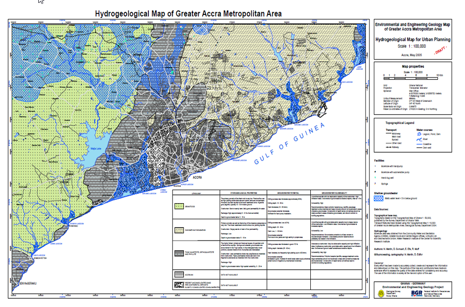
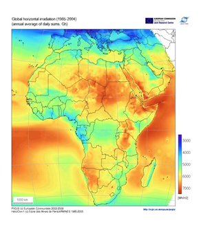

<!--
Markdown transcription of the original 2013 thesis appendix.

Text, data, and organization are preserved as closely as practical from PDF extraction.
Figures are embedded from `../figures/`.
Tables have been reconstructed as Markdown tables where the source extraction was recoverable.
Equations are formatted in one-line `$$ ... $$` blocks for reliable GitHub rendering.

Important archival note:
The Weibull wind-distribution subsection contains a mathematical correction to an error in the
original 2013 submission. The correction is explicitly identified below so the historical record
remains clear. The original PDF remains authoritative for the submitted thesis.
-->

# Appendix

## i. Water Demand Forecast — Assumptions

| Year | Minimum demand (m³/day) | Maximum demand (m³/day) |
|---:|---:|---:|
| 2005 | 400,000 | 400,000 |
| 2010 | 600,000 | 650,000 |
| 2015 | 750,000 | 850,000 |
| 2020 | 900,000 | 1,250,000 |
| 2025 | 1,200,000 | 1,600,000 |
| 2030 | 1,500,000 | 2,400,000 |

## ii. Electricity Demand Forecast — Assumptions

| Year | Peak demand (MW) | Maximum generation (MW) | Peak demand + 20% reserve (MW) |
|---:|---:|---:|---:|
| 2010 | 1,547 | 1,935 | 1,856 |
| 2011 | 1,670 | 1,935 | 2,004 |
| 2012 | 1,804 | 2,260 | 2,165 |
| 2013 | 1,948 | 3,430 | 2,338 |
| 2014 | 2,104 | 3,600 | 2,525 |
| 2015 | 2,273 | 3,600 | 2,727 |
| 2016 | 2,454 | 3,600 | 2,945 |
| 2017 | 2,651 | 3,600 | 3,181 |
| 2018 | 2,863 | 3,600 | 3,436 |
| 2019 | 3,092 | 3,600 | 3,710 |
| 2020 | 3,339 | 3,600 | 4,007 |
| 2021 | 3,607 | 3,600 | 4,328 |
| 2022 | 3,895 | 3,600 | 4,674 |
| 2023 | 4,207 | 3,600 | 5,048 |
| 2024 | 4,543 | 3,600 | 5,452 |
| 2025 | 4,907 | 3,600 | 5,888 |

## iii. Hydrogeology of the Study Area



*Appendix Figure 1. Hydrogeological map of the Greater Accra Metropolitan Area.*

## iv. Energy Supply — Assumptions

### Solar Energy Potential



*Appendix Figure 2. Global horizontal irradiation map used as regional context for the solar-resource assessment.*

| Month | Average solar insolation (kWh/m²/day) |
|---|---:|
| January | 5.18 |
| February | 5.34 |
| March | 5.24 |
| April | 5.28 |
| May | 4.89 |
| June | 4.36 |
| July | 4.51 |
| August | 4.37 |
| September | 4.42 |
| October | 4.89 |
| November | 4.96 |
| December | 4.98 |
| **Average** | **4.88** |

Equation source in the original thesis: MIT.

For a demonstration-scale PV-powered desalination facility of 60,000 m³/day:

$$ E_{day} = (60{,}000\ \mathrm{m^3/day})(3.63\ \mathrm{kWh/m^3}) = 217{,}800\ \mathrm{kWh/day} $$

$$ E_{year} = 217{,}800 \times 365 = 79{,}497{,}000\ \mathrm{kWh/year} $$

Using an annual solar resource of approximately 1,781.2 kWh/m²/year and an assumed total system conversion efficiency of 12%:

$$ A_{PV} = \frac{79{,}497{,}000}{1{,}781.2 \times 0.12} = 371{,}933.19\ \mathrm{m^2} $$

Thus the estimated land requirement is approximately **371,933 m²**, or **37.1 hectares**.

## v. Wind Energy Potential

### Wind-Speed Data

*Accra, Ghana wind speeds at 1.225 kg/m³ air density.*

| Sensor height | July | August | September | October | November | December |
|---|---:|---:|---:|---:|---:|---:|
| 12 m | 4.56 | 5.41 | 5.49 | 6.36 | 5.08 | 4.74 |
| 40 m | 5.41 | 6.31 | 6.54 | 7.54 | 6.02 | 5.18 |
| Satellite | 5.4–6.0 | 4.6–5.2 | 4.8–5.3 | 4.5–5.0 | 3.5–3.7 | 3.6–4.2 |

For the Vestas V90-3 MW offshore turbine, the original calculation used a 90 m rotor diameter and a 60 m hub height.

The original appendix gave a mean 40 m wind speed of approximately 6.17 m/s and a Hellmann-adjusted hub-height mean of approximately **6.38 m/s**.

### Weibull Distribution — Corrected

> **Correction to the 2013 submission:** the original appendix wrote the Weibull cumulative distribution function and then treated the resulting value as though it were the wind-speed probability at a point. That is not correct. A Weibull **CDF** gives the probability that wind speed is less than or equal to a threshold; the **PDF** gives a probability density. In addition, if the observed mean wind speed is used with an assumed shape parameter \(k=2\), the scale parameter should be derived from the Weibull mean rather than from the root-mean-square formula shown in the original appendix.

The Weibull probability density function is:

$$ f(v) = \frac{k}{A}\left(\frac{v}{A}\right)^{k-1} e^{-(v/A)^k} $$

The cumulative distribution function is:

$$ F(v) = 1 - e^{-(v/A)^k} $$

For a Weibull distribution, mean wind speed is:

$$ \bar v = A\,\Gamma\left(1+\frac{1}{k}\right) $$

Assuming \(k=2\) and \(\bar v = 6.38\ \mathrm{m/s}\):

$$ A = \frac{6.38}{\Gamma(1.5)} \approx 7.20\ \mathrm{m/s} $$

So the corrected Weibull parameters are approximately:

- **shape parameter:** \(k = 2\)
- **scale parameter:** \(A \approx 7.20\ \mathrm{m/s}\)

At \(v = 6.38\ \mathrm{m/s}\), the CDF is:

$$ F(6.38) = 1 - e^{-(6.38/7.20)^2} \approx 0.544 $$

This means roughly **54% of modeled wind speeds lie at or below 6.38 m/s**. It is **not** a point probability.

For wind-energy estimation, the relevant quantity is the expected value of \(v^3\), not simply the cube of the mean velocity:

$$ E[v^3] = A^3\Gamma\left(1+\frac{3}{k}\right) $$

With \(k=2\), \(A\approx 7.20\ \mathrm{m/s}\), and air density \(\rho=1.225\ \mathrm{kg/m^3}\):

$$ \frac{P}{A_{rotor}} = \frac{1}{2}\rho E[v^3] \approx 303.8\ \mathrm{W/m^2} $$

This is the **available wind-power density before turbine-efficiency and power-curve losses**.

## vi. Biomass Potential

### Agricultural Residues in Ghana, 2008

*Source: M. H. Duku et al.*

| Crop | Production (×10³ tonnes) | Residue type | Residue/product ratio | Moisture content (%) | Wet residue (×10³ tonnes) | Dry residue (×10³ tonnes) |
|---|---:|---|---:|---:|---:|---:|
| Sorghum | 350 | Stalk | 2.62 | 15 | 917 | 779.45 |
| Millet | 160 | Stalk | 3.00 | 15 | 480 | 408.00 |
| Rice | 242 | Straw | 1.50 | 15 | 363 | 308.55 |
| Sugarcane | 145 | Bagasse | 0.30 | 75 | 43.5 | 10.88 |
| Coconut | 316 | Shell | 0.60 | 10 | 189.6 | 170.64 |
| Oil palm | 1,900 | EFB | 0.25 | 60 | 475.0 | 190.00 |
| Coffee | 165 | Husk | 2.10 | 15 | 346.5 | 294.53 |
| Cocoa | 700 | Pods/husk | 1.00 | 15 | 700 | 595.00 |
| Maize | 1,100 | Stalk | 1.50 | 15 | 1,650 | 1,402.50 |
| **Total** |  |  |  |  | **4,821.60** | **4,159.55** |

### Wood Products

| Product | Production (×10³ m³) | Consumption (×10³ m³) |
|---|---:|---:|
| Wood fuel | 33,040 | 33,040 |
| Industrial round wood | 1,304 | 1,305 |
| Sawn wood | 527 | 317 |
| Wood pulp | 0 | 0 |
| Wood-based panels | 335 | 161 |
| Paper/paper board | 0 | 0 |

### Livestock

| Livestock | Number |
|---|---:|
| Cattle | 1,427 |
| Goats | 3,704 |
| Pigs | 239 |
| Sheep | 3,420 |
| Poultry | 31,000 |

## vii. Calculations for the Weighted Product Model

### Water Supply

| Alternative | Weighted product |
|---|---:|
| Weija | 2,800 |
| Volta | 6,720 |
| Groundwater | 5,250 |
| Rainwater | 4,704 |
| Wastewater recycling | 7,200 |
| Other surface water | 2,500 |
| Seawater | 8,820 |

### Energy Supply

| Alternative | Weighted product |
|---|---:|
| PV | 448 |
| CSP | 525 |
| Wind | 1,344 |
| Natural gas | 2,048 |
| Ocean | 96 |
| Biomass | 1,728 |
| Geothermal | 17.5 |
| Co-firing | 2,016 |
| Nuclear | 756 |

### Power–Desalination Coupling

| Combination | Weighted product | Combination | Weighted product |
|---|---:|---|---:|
| NG–RO | 11,796,480 | Geothermal–RO | 100,800 |
| NG–RO brackish | 5,505,024 | Geothermal–RO brackish | 47,040 |
| NG–ED | 5,505,024 | Geothermal–ED | 47,040 |
| NG–MSF | 8,128,512 | Geothermal–MSF | 69,457.5 |
| NG–MED | 6,322,176 | Geothermal–MED | 54,022.5 |
| NG–VC | 884,736 | Geothermal–VC | 7,560 |
| Ocean–RO | 552,960 | Co-firing–RO | 11,612,160 |
| Ocean–RO brackish | 258,048 | Co-firing–RO brackish | 5,419,008 |
| Ocean–ED | 258,048 | Co-firing–ED | 5,419,008 |
| Ocean–MSF | 381,024 | Co-firing–MSF | 8,001,504 |
| Ocean–MED | 296,352 | Co-firing–MED | 6,223,392 |
| Ocean–VC | 41,472 | Co-firing–VC | 870,912 |
| Biomass–RO | 9,953,280 | Nuclear–RO | 4,354,560 |
| Biomass–RO brackish | 4,644,864 | Nuclear–RO brackish | 2,032,128 |
| Biomass–ED | 4,644,864 | Nuclear–ED | 2,032,128 |
| Biomass–MSF | 6,858,432 | Nuclear–MSF | 3,000,564 |
| Biomass–MED | 5,334,336 | Nuclear–MED | 2,333,772 |
| Biomass–VC | 746,496 | Nuclear–VC | 326,592 |

### Water Source–Power–Desalination Matrix

The original appendix contains the full numerical matrix used for the combined weighted-product comparison. The PDF-to-text extraction lost the row labels, so reconstructing those labels would require speculation.

For archival accuracy, the numerical block is retained below exactly as extracted; consult the original PDF for the row/column layout.

```text
Groundwater   Rainwater   Wastewater Recycling   Other Surface Water   Seawater
13547520000   12138577920 18579456000             6451200000            22759833600
6322176000    5664669696  8670412800              3010560000            10621255680
6322176000    5664669696  8670412800              3010560000            10621255680
9335088000    8364238848  12802406400             4445280000            15682947840
7260624000    6505519104  9957427200              3457440000            12197848320
1016064000    910393344   1393459200              483840000             1706987520
...
```

*The complete matrix remains available in the original PDF.*

## viii. Power Plant Output Calculations

### Gas Turbine Inputs

| Parameter | Value |
|---|---:|
| LNG input | 200,000,000 ft³/day |
| LNG input | 5,663,360 m³/day |
| LNG mass | 4,360,787.2 kg/day |
| LNG mass flow | 50.4721 kg/s |
| Air mass flow | 2,119.827 kg/s |
| Total mass flow | 2,170.299 kg/s |
| Pressure ratio | 18.5 |
| Heat input, Qin | 2,705.303 MW |
| Compressor inlet temperature | 300 K |
| Turbine inlet temperature | 1,644 K |
| Compressor efficiency | 0.90 |
| Turbine efficiency | 0.90 |

Selected relations used in the calculation:

$$ w_t = h_3-h_4 $$

$$ w_c = h_2-h_1 $$

$$ q_{in} = h_3-h_2 $$

$$ q_{out} = h_4-h_1 $$

The appendix reports the following later-stage values:

| Quantity | Value |
|---|---:|
| \(h_1\) | 300.19 kJ/kg |
| \(h_2\) | 691.82 kJ/kg |
| \(h_3\) | 1,806.46 kJ/kg |
| \(h_4\) | 821.95 kJ/kg |
| Compressor work | 435.144 kJ/kg |
| Turbine work | 886.059 kJ/kg |
| Net work | 450.915 kJ/kg |
| Turbine power | 917,163.121 kJ/s |
| Heat input | 1,114.64 kJ/kg |
| Heat rejection | 521.76 kJ/kg |
| Qin | 2,267,184.966 kJ/s |
| Efficiency | 0.40454 |

### Steam Generator / Heat Exchanger

The appendix models an ideal Rankine cycle operating between 7 MPa and 10 kPa, with steam heated to 500 °C and exhaust gas leaving the heat exchanger at 450 K.

Energy balance:

$$ \dot m_g h_5' + \dot m_s h_3 = \dot m_g h_4' + \dot m_s h_2 $$

Rearranged:

$$ \dot m_s(h_3-h_2) = \dot m_g(h_4'-h_5') $$

Using the reported values:

$$ \frac{\dot m_s}{\dot m_g} = 0.133 $$

Thus, approximately 1 kg of exhaust gas heats 0.133 kg of steam from 33 °C to 500 °C.

Steam-flow estimate:

$$ 111.66\ \mathrm{kg/s} \times 0.133 = 15.30\ \mathrm{kg/s} $$

### Air–Fuel Ratio

| Parameter | Value |
|---|---:|
| LHV | 46,798 kJ/kg |
| Fuel mass term | 1,201.588 |
| Air mass term | 44,912.33 |
| AFR | 37.37748 |

## ix. Reverse Osmosis Calculations

### Osmotic Pressure

The extracted appendix gives a feed osmotic pressure of approximately **208.24 psia** and a permeate osmotic pressure of approximately **0.375 psia**, yielding:

$$ \Delta\pi \approx 207.87\ \mathrm{psia} \approx 1{,}433.18\ \mathrm{kPa} $$

### System Assumptions

| Parameter | Value |
|---|---:|
| Feed flow, Q | 1,000,000 m³/day |
| Recovery ratio, RR | 0.48 |
| Salt rejection | 99.82% |
| Feed concentration, \(C_f\) | 0.606838 |
| Permeate concentration, \(C_p\) | 0.001092 |

### Membrane

| Model | Active surface area | Permeate flow | Boron rejection | Salt rejection |
|---|---:|---:|---:|---:|
| SW30XHR-440i | 41 m² | 25 m³/day | 93% | 99.82% |

### Solvent Flow / Array Sizing

| Parameter | Value |
|---|---:|
| Solvent permeability, Pw | 1.25663 × 10⁻⁶ |
| Membrane thickness, Δx | 3.20 × 10⁻³ |
| Aw | 3.93 × 10⁻⁴ kg/s·m² |
| Water flux, Jw | 0.0108611 kg/s·m² |
| Recommended flux | 23 gfd |
| Vessels | 1,559.48 (8 modules) |
| Trains | 12.996 (120 vessels) |
| Modules | 12,475.83 |
| Total membrane area | 511,508.95 m² |
| Product flow | 480,000 m³/day |

### Energy Recovery

| Parameter | Value |
|---|---:|
| Concentrate pressure, Pc | 27.5788 bar |
| Motor efficiency | 0.96 |
| Turbine efficiency | 0.85 |
| Energy recovery | 1.09453 kWh/m³ |

### Energy Demand

| Component | Energy (kWh/m³) |
|---|---:|
| Supply | 0.11229 |
| Transfer | 0 |
| High-pressure pump | 4.34810 |
| Product | 0 |
| Auxiliary | 0.05 |
| Turbine recovery | −1.09453 |
| **Total** | **3.41586** |

## x. Cost Estimates

### Electricity Supply Cost

| Parameter | Value |
|---|---:|
| TCR | $1,394,735,580 |
| Annuity factor, Ψ | 0.0782267 |
| Rated power output, P | 1,426.11 MW |
| Equivalent utilization time, Teq | 6,570 h/a |
| Fuel price, YF | $22.76471/MWh thermal |
| Average net efficiency, η | 0.5888 |
| Fixed O&M, Ufix | $10,000,000 |
| Variable O&M, uvar | $3/MWh |
| Discount rate, z | 0.08 |
| Amortization period, n | 25 years |
| **Yel** | **$54.37/MWh = $0.05437/kWh** |

### Desalination Capital Cost

| Cost item | Reference cost (USD) | Reference unit cost | 480,000 m³/day estimate (USD) |
|---|---:|---:|---:|
| Site preparation, roads, parking | 1,982,000 | 10.77174 | 4,352,010.58 |
| Intake | 9,910,000 | 53.8587 | 0.00 |
| Pretreatment | 15,856,000 | 86.17391 | 34,816,084.66 |
| RO system equipment | 71,352,000 | 387.7826 | 156,672,380.95 |
| Post-treatment | 3,964,000 | 21.54348 | 3,964,000.00 |
| Concentrate disposal | 5,946,000 | 32.31522 | 0.00 |
| Residuals management | 2,973,000 | 16.15761 | 6,528,015.87 |
| Electrical system | 4,955,000 | 26.92935 | 10,880,026.46 |
| Product storage & distribution | 3,964,000 | 21.54348 | 8,704,021.16 |
| Buildings | 9,910,000 | 53.8587 | 21,760,052.91 |
| Startup costs | 3,964,000 | 21.54348 | 8,704,021.16 |
| Project engineering services | 21,802,000 | 118.49 | 47,872,116.40 |
| Environmental permitting | 9,910,000 | 53.8587 | 0.00 |
| Legal services | — | — | 6,528,015.87 |
| Project financing costs | 23,784,000 | 129.26 | 52,224,126.98 |
| Contingency | 12,883,000 | 70.0163 | 28,288,068.78 |
| **Total capital costs** | **208,110,000** | **1,131.033** | **402,172,968.25** |

### Annual Cost

| Item | Annual cost (USD) |
|---|---:|
| Operation & maintenance | 1,826,400 |
| Replacement parts & materials | 14,268,000 |
| Replacement membranes | 6,086,400 |
| Power | 30,747,600 |
| Chemicals | 14,500,800 |
| Capital-cost amortization | 28,535,160.34 |
| **Total** | **95,964,360.34** |
| **Unit cost** | **$0.54774/m³** |

## xi. Seawater Temperature

| Parameter | Value |
|---|---:|
| f(d) | 3.046232 |
| Surface temperature, S | 28 °C |
| Depth, D | 33 m |
| Estimated intake temperature, T | 23.38729 °C |

## xii. Emissions Data

| Pollutant | lb per billion Btu | lb/day | kg/day | tonnes/day |
|---|---:|---:|---:|---:|
| Carbon dioxide | 120,000 | 22,395,660.19 | 10,158,492 | 10,158.49 |
| Carbon monoxide | 40 | 7,465.220064 | 3,386.164 | 3.386164 |
| Nitrous oxides | 92 | 17,170.00615 | 7,788.177 | 7.788177 |
| Sulphur dioxide | 1 | 186.6305016 | 84.6541 | 0.084654 |
| Particulates | 7 | 1,306.413511 | 592.5787 | 0.592579 |
| Mercury | 0 | 0 | 0 | 0 |

## xiii. Chemical Use

*Plant flow: 480,000 m³/day.*

| Chemical | Dose (mg/L) | Total (mg/day) | Total (kg/day) |
|---|---:|---:|---:|
| Chlorination | 5 | 2,400,000,000 | 2,400 |
| Ferric sulfate | 6 | 2,880,000,000 | 2,880 |
| Sodium bisulfite | 4 | 1,920,000,000 | 1,920 |
| Sulfuric acid | 40 | 19,200,000,000 | 19,200 |
| Phosphonates | 5 | 2,400,000,000 | 2,400 |
| Cationic polymer | 2 | 960,000,000 | 960 |
